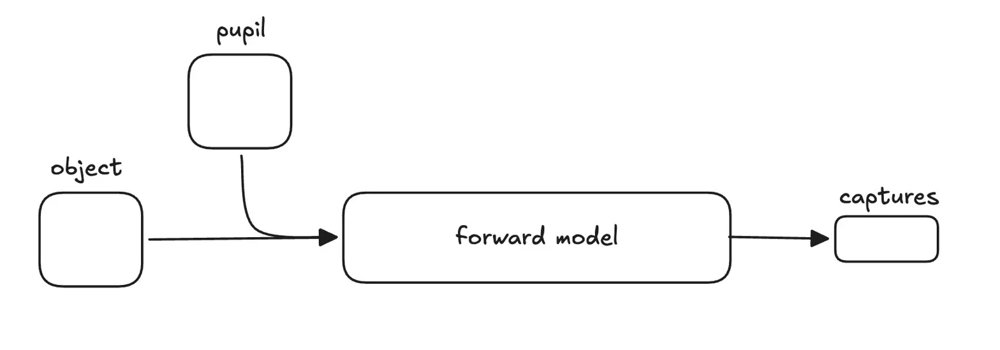

# fpm-py

fpm-py is a python/pytorch library for Fourier ptycography microscopy. It uses a series of low-resolution microscopy captures made under varrying illumination angles to reconstruct a higher-resolution image of the sample.

The latent scene of an object (the sample's complex-valued transmittance) and pupil (transfer function of the optical system) are passed through a physics-based forward model, emulating computationally what happens to light physically.

To reduce optimization dimensionality, the pupil is parameterized in a Zernike basis, which is a well-established approximation of real lens aberrations.

We then use AdamW to fit the latent scene so its predicted captures match the measured ones, and read out the high-resolution reconstruction as the intensity of the learned object.

Forward model:

$$I_j(\mathbf{r}) = \left|\, \mathcal{F}^{-1}\!\left\{ P(\mathbf{k}) \cdot \mathcal{F}\!\left\{ O(\mathbf{r})\, e^{i 2\pi \mathbf{k}_j \cdot \mathbf{r}} \right\} \right\} \right|^2$$

Optimization objective:

$$\mathcal{L} = \sum_j \left\| \sqrt{I_j^{\text{pred}} + \epsilon} - \sqrt{I_j^{\text{meas}} + \epsilon} \right\|_2^2$$
