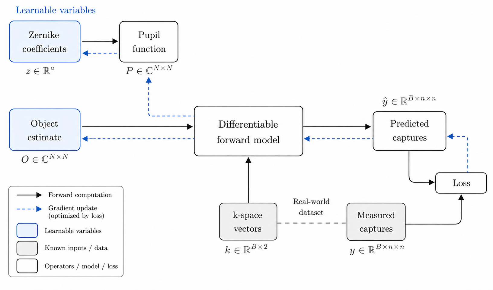

# fpm-py

fpm-py is a python/pytorch library for Fourier ptycography microscopy. It uses a series of low-resolution microscopy captures made under varrying illumination angles to reconstruct a higher-resolution image of the sample.

The latent scene of an object (the sample's complex-valued transmittance) [src/ptych/core/object.py](src/ptych/core/object.py) and pupil (transfer function of the optical system) [src/ptych/core/pupil.py](src/ptych/core/pupil.py) are passed through a physics-based forward model [src/ptych/core/forward.py](src/ptych/core/forward.py), emulating computationally what happens to light physically.

Forward model:

```math
\begin{aligned}
I_j(\mathbf{r})
&=
\left\lvert
\mathcal{F}^{-1}\!\left[
P(\mathbf{k}) \cdot
\mathcal{F}\!\left[
O(\mathbf{r})\, e^{i2\pi \mathbf{k}_j \cdot \mathbf{r}}
\right]
\right]
\right\rvert^2
\end{aligned}
```

To reduce optimization dimensionality, the pupil is parameterized in a Zernike basis [src/ptych/core/zernike.py](src/ptych/core/zernike.py), which is a well-established approximation of real lens aberrations.

We then use AdamW to fit the latent scene so its predicted captures match the measured ones, and read out the high-resolution reconstruction as the intensity of the learned object [src/ptych/core/solver.py](src/ptych/core/solver.py).

Optimization objective:

```math
\mathcal{L} = \sum_j
\left\lVert
\sqrt{I_j^{\text{pred}} + \epsilon}
-
\sqrt{I_j^{\text{meas}} + \epsilon}
\right\rVert_2^2
```


